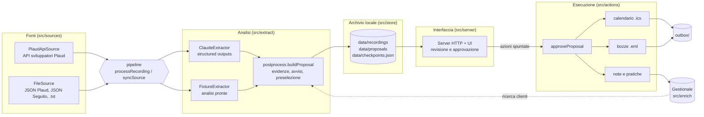

# Architettura di Seguito

Questo documento descrive com'è fatto Seguito: i moduli, il percorso dei dati, i contratti tra le parti e il modo di aggiungere un collegamento (un calendario, un gestionale, una nuova fonte di registrazioni). Serve a chi sviluppa o mantiene l'applicazione. Per l'uso quotidiano basta il [README](../README.md).

## In sintesi

Seguito è un'applicazione Node.js 22 scritta in TypeScript, senza framework e senza database. Gira su un computer dello studio. Il percorso dei dati è lineare:

1. una **fonte** fornisce la registrazione già trascritta (Plaud o file locali);
2. un **estrattore** la trasforma in dati strutturati (Claude, oppure le analisi di esempio);
3. il **post-processo** verifica le citazioni, collega i partecipanti al gestionale, aggiunge gli avvisi e decide che cosa preselezionare: il risultato è la **proposta**;
4. l'avvocato rivede la proposta nell'**interfaccia web** e approva le azioni;
5. gli **esecutori** producono i risultati: file `.ics` ed `.eml`, note e pratiche nel gestionale.

Ogni passaggio comunica con il successivo solo attraverso i tipi definiti in `src/domain/types.ts`. Per questo una parte si può sostituire senza toccare le altre.



## Moduli e responsabilità

| Modulo | File principali | Responsabilità |
|---|---|---|
| **domain** | `src/domain/types.ts`, `src/domain/time.ts` | Contratti condivisi (schemi zod e tipi) e funzioni su date e fusi orari. Nessuna dipendenza dagli altri moduli. |
| **sources** | `src/sources/source.ts`, `plaud-api.ts`, `plaud-parse.ts`, `file-source.ts` | Interfaccia `RecordingSource` e due implementazioni: l'API sviluppatori di Plaud e la lettura di file locali. Convertono tutto in `Recording`. |
| **extract** | `src/extract/extractor.ts`, `prompt.ts`, `claude-extractor.ts`, `fixture-extractor.ts` | Interfaccia `Extractor`. `ClaudeExtractor` costruisce il prompt e chiede a Claude un `Extraction` conforme allo schema. `FixtureExtractor` legge analisi già pronte (demo e prove). |
| **postprocess** | `src/extract/postprocess.ts` | Da `Extraction` a `Proposal`: verifica delle citazioni, collegamento dei partecipanti al gestionale, completamento degli indirizzi email, avvisi, preselezione e azione di sistema «invio della trascrizione». |
| **enrich** | `src/enrich/case-management.ts`, `json-case-management.ts` | Interfaccia `CaseManagement` verso il gestionale e implementazione su file JSON: ricerca dei clienti con punteggio, anagrafiche, pratiche e note. |
| **actions** | `src/actions/executor.ts`, `executors.ts`, `run.ts`, `ics.ts`, `eml.ts`, `format.ts` | Interfaccia `ActionExecutor`, esecutori predefiniti per ogni tipo di azione, flusso di approvazione (`approveProposal`, `discardProposal`), generazione dei file `.ics` ed `.eml`, testi in italiano. |
| **store** | `src/store/store.ts`, `json-store.ts` | Interfaccia `Store` e archivio su file JSON in `data/`: registrazioni, proposte, punti di sincronizzazione. Scritture atomiche, cartelle `0700`, file `0600`. |
| **server** | `src/server/app.ts`, `src/server/ui/` | Server HTTP (solo `node:http`) con API JSON, download dei file dell'outbox e interfaccia web in JavaScript puro. Autenticazione Basic facoltativa e intestazioni di sicurezza restrittive. |
| **pipeline** | `src/pipeline.ts` | `processRecording` (registrazione → proposta, una volta sola), `syncSource` (scarica dalla fonte le registrazioni nuove e le elabora, senza fermarsi al primo errore), `approveStoredProposal` e `discardStoredProposal` (approvazione e scarto delle proposte archiviate, usati dal server). |
| **cli** | `src/cli.ts` | Comandi `demo`, `serve`, `poll`, `ingest`: compongono fonti, estrattori, archivio e server a partire dalla configurazione (`src/config.ts`). |

## Il percorso dei dati

### 1. Dalla fonte alla registrazione

`RecordingSource.listRecent()` restituisce i riferimenti (`RecordingRef`) alle registrazioni recenti; `fetchRecording(externalId)` scarica la trascrizione completa. Il risultato è una `Recording`:

- `id` interno stabile, `"<fonte>:<id esterno>"` (per esempio `plaud:abc123` o `file:demo-rossi-decreto-ingiuntivo`);
- `startedAt` in ISO 8601 UTC;
- `segments`: gli interventi numerati da 0, con minuto di inizio, parlante (`Speaker 1`, `Speaker 2`, ...) e testo;
- `plaudSummary`: il riassunto prodotto da Plaud con il template dello studio, se c'è.

`syncSource` salta le registrazioni che hanno già una proposta. Quelle ancora senza trascrizione (`PlaudNotReadyError`) vengono contate a parte e riprovate al giro successivo. Al termine registra nell'archivio il punto di sincronizzazione `lastSync:<fonte>`.

### 2. Dalla registrazione all'analisi

`Extractor.extract({ recording, studio, now })` restituisce un `Extraction`:

- `conversationType`, `summary` (al massimo 5 righe), `participants` con il ruolo di ciascuno;
- `actions`: appuntamenti, incarichi, accordi economici, scadenze, documenti, email, attività;
- `doubts`: i punti da chiarire.

Ogni partecipante, azione e dubbio porta una o più **evidenze**: il numero del segmento e una citazione letterale.

`ClaudeExtractor` invia una sola richiesta per registrazione. Il prompt di sistema (`buildSystemPrompt`) contiene le regole dello studio. Il messaggio utente (`buildUserContent`) contiene titolo, data e ora con il giorno della settimana (per risolvere espressioni come «giovedì prossimo»), l'eventuale riassunto Plaud, indicato come ausiliario, e la trascrizione con una riga per segmento: `#12 [03:06] Speaker 1: testo`. La risposta è vincolata allo schema `ExtractionSchema` con gli structured outputs. Il modello, il livello di ragionamento e la chiave vengono dalla configurazione.

### 3. Dall'analisi alla proposta

`buildProposal` produce la `Proposal` che l'avvocato vede:

- **Evidenze verificate.** Ogni citazione viene cercata nel segmento indicato, o a cavallo con il successivo, dopo una normalizzazione: senza accenti, minuscole, punteggiatura ridotta a spazi. Le citazioni non ritrovate sono marcate `verified: false` e l'azione riceve l'avviso `EVIDENZA_NON_VERIFICATA`.
- **Collegamento al gestionale.** Clienti, potenziali clienti e consulenti vengono cercati con `CaseManagement.findClients`. Il miglior candidato con punteggio di almeno 0,6 diventa il `clientMatch`. Se un'email non ha l'indirizzo, lo prende dal cliente collegato.
- **Avvisi per azione.** Data mancante, non valida o già trascorsa; termine processuale sempre `TERMINE_DA_VERIFICARE`; destinatario mancante; cliente non presente nel gestionale; affidabilità bassa.
- **Avviso deontologico.** Se tra i partecipanti che parlano c'è un altro avvocato, la proposta riceve l'avviso bloccante `COLLEGA_ART38` e nessuna azione viene preselezionata (vedi [privacy-e-deontologia.md](privacy-e-deontologia.md)).
- **Preselezione.** Un'azione è preselezionata se l'affidabilità è almeno 0,75 e non ha avvisi di livello «attenzione» o «bloccante».
- **Azione di sistema.** In coda c'è sempre l'invio della trascrizione alla casella dello studio.

### 4. Approvazione ed esecuzione

L'interfaccia invia un `ApprovalRequest`: gli id delle azioni spuntate e le eventuali modifiche ai campi. `approveProposal` valida le modifiche con `ActionPayloadSchema` ed esegue le azioni una alla volta. Per ciascuna sceglie il primo esecutore il cui `canHandle` risponde sì. Poi registra un `ExecutionResult` (ok, errore o saltata, con i file prodotti) e restituisce una nuova proposta con lo stato aggiornato. Le azioni già eseguite con successo non vengono ripetute. Le azioni non spuntate restano approvabili anche quando la proposta è «eseguita» (per esempio una scadenza approvata dopo la verifica sul fascicolo).

Esecutori predefiniti (`defaultExecutors()`):

| Esecutore | Azioni | Risultato |
|---|---|---|
| `calendario-appuntamenti` | `appuntamento` | `.ics` se fissato; bozza `.eml` al cliente se da fissare |
| `calendario-scadenze` | `scadenza` | `.ics` con promemoria e avvertenza di verifica |
| `bozze-email` | `email` | `.eml` con intestazione `X-Unsent: 1`, quindi aperto come bozza |
| `invio-trascrizione` | `invio_trascrizione` | `.eml` alla casella dello studio con la trascrizione in allegato |
| `gestionale` | `incarico`, `accordo_economico`, `documenti`, `attivita` | note nella pratica; nuovo cliente o nuova pratica se servono |

I file vanno in `outbox/<id della proposta>/<id azione>-<titolo>.<estensione>`.

## I contratti (`src/domain/types.ts`)

| Tipo | Che cosa rappresenta |
|---|---|
| `Recording`, `Segment`, `RecordingRef` | La registrazione trascritta e i suoi interventi; il riferimento sintetico usato negli elenchi. |
| `Extraction`, `ExtractedAction` e gli schemi delle singole azioni | L'output del modello. Gli schemi sono inviati a Claude come JSON Schema: tutti i campi sono obbligatori, eventualmente `null`. |
| `Evidence`, `ResolvedEvidence` | La citazione indicata dal modello e la stessa citazione verificata sul testo, con minuto e parlante. |
| `Proposal`, `ProposedAction`, `ProposalParticipant`, `ClientMatch` | La proposta per l'avvocato: azioni con payload, evidenze, avvisi e preselezione; partecipanti con l'eventuale collegamento al gestionale. |
| `ActionPayload` | Il contenuto eseguibile di un'azione: i campi del modello senza affidabilità, evidenze e motivazione, più `invio_trascrizione`. |
| `Warning`, `WarningCode` | Avvisi con livello `info`, `attenzione` o `bloccante`. |
| `ApprovalRequest`, `ExecutionResult`, `ExecutionArtifact` | La richiesta di approvazione e l'esito di ogni azione, con i file o le note prodotti. |
| `StudioProfile` | I dati dello studio: nomi, indirizzi email, fuso orario, link di prenotazione, firma. |
| `Client`, `Matter`, `MatterNote`, `CaseManagementData` | Anagrafiche, pratiche e note del gestionale. |

Le date locali sono stringhe nel fuso dello studio: `"YYYY-MM-DD"` per i giorni e `"YYYY-MM-DDTHH:mm"` per giorno e ora. Le conversioni passano sempre da `src/domain/time.ts` (`zonedLocalToUtc`, `localDateOf`, `formatItalianDateTime`, ...).

## Integrazione con Plaud

Seguito usa la **developer API ufficiale di Plaud** (`https://platform.plaud.ai/developer/api`), con gli stessi endpoint della CLI ufficiale `@plaud-ai/cli`:

- `GET /open/third-party/files/?page=<n>&page_size=50`: elenco delle registrazioni, letto a pagine (al massimo 10); la lettura si ferma prima quando una pagina è incompleta o, se è indicata una data di partenza, quando tutte le registrazioni della pagina sono precedenti;
- `GET /open/third-party/files/<id>`: dettaglio di una registrazione.

**Accesso.** Non c'è una chiave da copiare. L'utente esegue `npx @plaud-ai/cli login` e la CLI salva i token OAuth in `~/.plaud/tokens.json`. Seguito li legge da lì (`PLAUD_TOKENS_PATH`) e, quando il token sta per scadere, lo rinnova e lo riscrive nello stesso file (scrittura atomica, permessi `0600`). Se il rinnovo è rifiutato, il messaggio d'errore chiede di ripetere il login. Token e trascrizioni non vengono mai scritti nei log.

**Trascrizione.** Nel dettaglio, `source_list` contiene i blocchi della registrazione. La trascrizione è il blocco `transaction` (in alternativa `transaction_polish`): un array JSON di interventi `{ start_time, end_time, speaker, content }` con i tempi in millisecondi. Il contenuto può essere già nel campo `data_content` oppure da scaricare dal collegamento temporaneo `data_link`. Il download accetta solo HTTPS, nessun indirizzo IP diretto, al massimo 20 MB e 30 secondi. Se la trascrizione non c'è ancora, la registrazione viene riprovata alla sincronizzazione successiva.

**Riassunto.** `note_list` contiene i riassunti generati da Plaud (`auto_sum_note`). Seguito preferisce quello prodotto con il template dello studio, riconosciuto dal titolo che contiene «Seguito» (vedi [plaud-setup.md](plaud-setup.md)). Il riassunto è passato a Claude come aiuto secondario: in caso di discordanza prevale la trascrizione.

**Orari.** Gli orari di Plaud senza fuso orario sono interpretati come UTC.

Gli stessi formati sono letti da `FileSource`. I file in `fixtures/plaud/` sono dettagli Plaud completi e servono da esempio.

## Aggiungere un collegamento

### Un nuovo modo di eseguire le azioni (Google Calendar, Microsoft 365, ...)

Si implementa `ActionExecutor` (`src/actions/executor.ts`):

```ts
import type { ActionExecutor, ExecutionContext } from "./executor.js";
import type { ExecutionResult, ProposedAction } from "../domain/types.js";

export class GoogleCalendarExecutor implements ActionExecutor {
  readonly name = "google-calendar";

  canHandle(action: ProposedAction): boolean {
    return action.payload.type === "appuntamento" && action.payload.status === "fissato";
  }

  async execute(action: ProposedAction, ctx: ExecutionContext): Promise<ExecutionResult> {
    // Crea l'evento con l'API del calendario usando action.payload e ctx.studio.timezone.
    return {
      actionId: action.id,
      executedAt: ctx.now.toISOString(),
      status: "ok",
      message: "Evento creato in Google Calendar.",
      artifacts: [{ kind: "altro", label: "Evento in Google Calendar", path: null, ref: "<id evento>" }],
    };
  }
}
```

L'esecutore va passato ad `approveProposal` **prima** di quelli predefiniti, per esempio con `executors: [new GoogleCalendarExecutor(), ...defaultExecutors()]`: vince il primo che risponde sì a `canHandle`. Regole da rispettare:

- non lanciare eccezioni per errori prevedibili: restituire `status: "errore"` con un messaggio in italiano comprensibile all'avvocato, senza dati personali superflui;
- usare le funzioni di `src/domain/time.ts` per date e fusi orari;
- se l'azione crea qualcosa all'esterno (un evento, una bozza), indicarne il riferimento in `artifacts[].ref`.

### Il gestionale dello studio

Si implementa `CaseManagement` (`src/enrich/case-management.ts`): `findClients`, `getClient`, `createClient`, `listMatters`, `createMatter`, `addMatterNote`. `findClients` deve restituire i candidati ordinati per punteggio decrescente, da 0 a 1. La proposta collega automaticamente un partecipante solo con punteggio di almeno 0,6, quindi il punteggio deve riflettere la qualità reale della corrispondenza: email esatta, telefono, nome e cognome, ragione sociale. L'adattatore si passa al posto di `JsonCaseManagement` nella pipeline e nell'approvazione. `tests/json-case-management.test.ts` è un buon riferimento per i casi da coprire.

### Una nuova fonte o un nuovo estrattore

- **Fonte** (un altro registratore, una cartella condivisa): si implementa `RecordingSource` e si usa con `syncSource`. Gli id delle registrazioni devono essere stabili, perché Seguito li usa per non analizzare due volte la stessa registrazione.
- **Estrattore** (un altro modello, o Claude tramite un fornitore cloud europeo): si implementa `Extractor` e si restituisce un oggetto valido per `ExtractionSchema`. Tutto il resto, dalla verifica delle citazioni agli avvisi, resta invariato.

## Sicurezza, in breve

- Il server ascolta su `127.0.0.1` per impostazione predefinita. Con `SEGUITO_PASSWORD` richiede l'autenticazione HTTP Basic su ogni richiesta.
- La Content Security Policy blocca script e stili esterni o inline. L'interfaccia costruisce il DOM senza `innerHTML`, perché trascrizioni e testi del modello non sono affidabili.
- I file dell'outbox sono serviti con controllo del percorso, senza possibilità di uscire dalla cartella.
- Il contenuto della trascrizione è trattato come dato, mai come istruzione: il prompt dice al modello di ignorare eventuali «istruzioni» pronunciate durante la conversazione.
